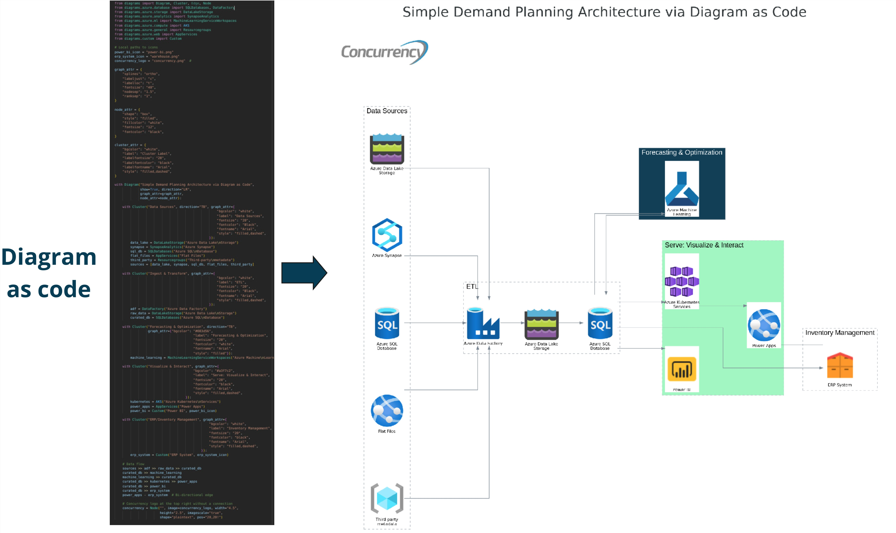

# Diagram as Code LinkedIn Demo

This repository uses the `diagrams` library to generate a visual representation of a simple demand planning architecture. The diagram includes various Azure services and a Concurrency logo in the upper right corner.

## Features

- Visualize data sources, ETL processes, raw data, curated data, distributed computing, forecasting & optimization, and ERP/inventory management.
- Includes Azure services like Azure Data Lake Storage, Azure Synapse, Azure SQL Database, Azure Data Factory, Azure Kubernetes Services, Azure Machine Learning, and more.
- Custom styling for clusters and nodes to enhance readability.
- Concurrency logo positioned in the upper right corner.

## Installation

1. **Clone the repository**:
    ```bash
    git clone https://github.com/yourusername/your-repo-name.git
    cd your-repo-name
    ```

2. **Create and activate a virtual environment**:
    ```bash
    python -m venv venv
    source venv/bin/activate  # On Windows, use `venv\Scripts\activate`
    ```

3. **Install the required packages**:
    ```bash
    pip install -r requirements.txt
    ```

## Usage

1. **Place the required images in the root directory**:
   - `concurrency.png`
   - `power-bi.png`
   - `warehouse.png`

2. **Run the script**:
    ```bash
    python azure_data_pipeline_diagram.py
    ```

3. **View the generated diagram**:
   The diagram will be generated and displayed automatically.

## Example Diagram




